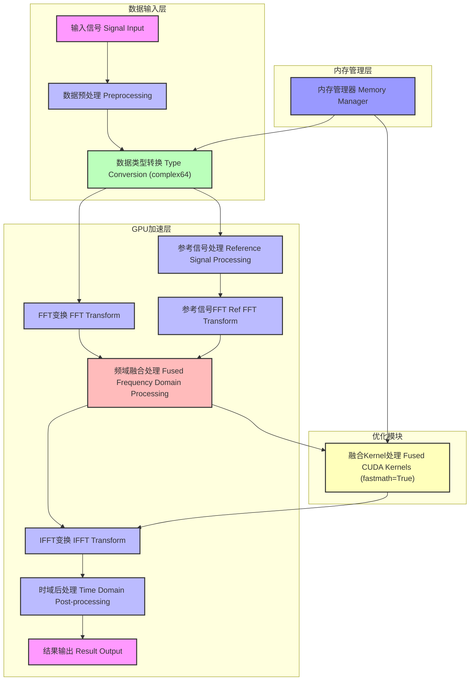
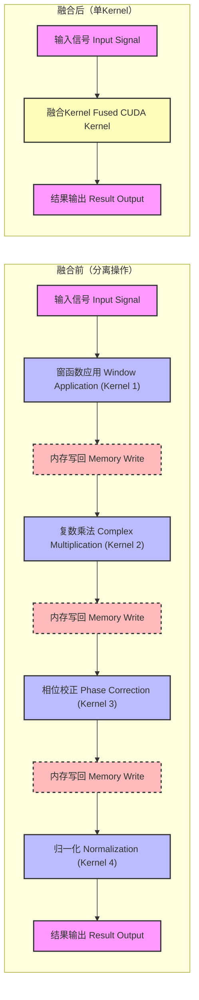
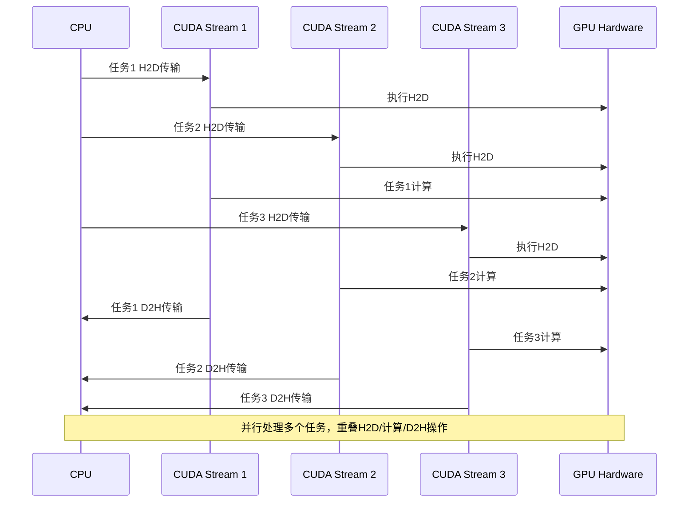
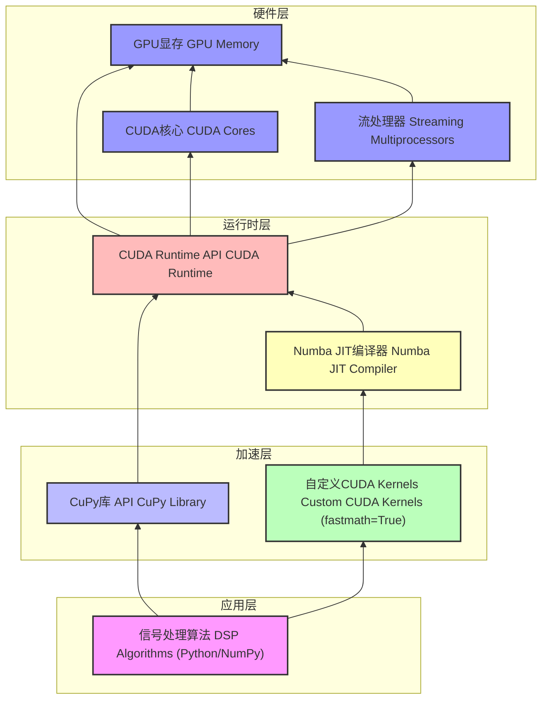

# GPU DSP流水线项目流程图

## 一、DSP流水线完整流程（Mermaid语法）



## 二、Kernel融合详细流程



## 三、异步传输与并行处理流程



## 四、算子硬件部署架构



## 五、Python代码实现图表

### 1. GPU加速性能对比图

```python
import matplotlib.pyplot as plt
import numpy as np

# 性能数据
operations = ['FFT', '卷积', '脉冲压缩']
cpu_time = [37.54, 47.64, 93.15]
gpu_time = [0.45, 4.90, 2.44]
speedup = np.array(cpu_time) / np.array(gpu_time)

# 创建图表
fig, ax1 = plt.subplots(figsize=(10, 6))

# 柱状图：时间对比
x = np.arange(len(operations))
width = 0.35

bar1 = ax1.bar(x - width/2, cpu_time, width, label='CPU时间(ms)', color='#3498db')
bar2 = ax1.bar(x + width/2, gpu_time, width, label='GPU时间(ms)', color='#2ecc71')

# 设置左侧Y轴
ax1.set_ylabel('时间 (ms)', fontsize=12)
ax1.set_xlabel('操作类型', fontsize=12)
ax1.set_xticks(x)
ax1.set_xticklabels(operations, fontsize=11)
ax1.legend(loc='upper left')
ax1.grid(True, alpha=0.3)

# 折线图：加速比
ax2 = ax1.twinx()
line = ax2.plot(x, speedup, 'ro-', linewidth=2, label='加速比(x)')
ax2.set_ylabel('加速比 (x)', fontsize=12, color='red')
ax2.tick_params(axis='y', labelcolor='red')
ax2.legend(loc='upper right')

# 添加数值标签
for i, (bar_cpu, bar_gpu, sp) in enumerate(zip(bar1, bar2, speedup)):
    height_cpu = bar_cpu.get_height()
    height_gpu = bar_gpu.get_height()
    ax1.text(bar_cpu.get_x() + bar_cpu.get_width()/2., height_cpu, 
             f'{height_cpu:.2f}', ha='center', va='bottom', fontsize=10)
    ax1.text(bar_gpu.get_x() + bar_gpu.get_width()/2., height_gpu, 
             f'{height_gpu:.2f}', ha='center', va='bottom', fontsize=10)
    ax2.text(i, sp, f'{sp:.1f}', ha='center', va='bottom', color='red', fontsize=10)

plt.title('GPU加速性能对比（1M样本）', fontsize=14)
plt.tight_layout()
plt.savefig('gpu_performance.png', dpi=300, bbox_inches='tight')
plt.show()
```

### 2. Kernel融合性能对比图

```python
import matplotlib.pyplot as plt
import numpy as np

# 数据
methods = ['分离操作(4步)', '简单融合kernel', '复杂融合kernel']
times = [1.52, 1.09, 1.59]
speedup = [(times[0]-t)/times[0]*100 for t in times]

# 创建图表
fig, ax1 = plt.subplots(figsize=(10, 6))

# 柱状图：时间
x = np.arange(len(methods))
bars = ax1.bar(x, times, color=['#95a5a6', '#2ecc71', '#f39c12'], alpha=0.8)

# 设置左侧Y轴
ax1.set_ylabel('处理时间 (ms)', fontsize=12)
ax1.set_xlabel('处理方案', fontsize=12)
ax1.set_xticks(x)
ax1.set_xticklabels(methods, fontsize=11, rotation=15)
ax1.grid(True, alpha=0.3, axis='y')

# 折线图：性能提升
ax2 = ax1.twinx()
line = ax2.plot(x, speedup, 'ro-', linewidth=2, label='性能提升(%)')
ax2.set_ylabel('性能提升 (%)', fontsize=12, color='red')
ax2.axhline(y=0, color='black', linestyle='-', alpha=0.3)

# 添加数值标签
for i, (bar, time, sp) in enumerate(zip(bars, times, speedup)):
    height = bar.get_height()
    ax1.text(bar.get_x() + bar.get_width()/2., height + 0.02, 
             f'{time:.3f}ms', ha='center', va='bottom', fontsize=10)
    ax2.text(i, sp + (1 if sp > 0 else -1), 
             f'{sp:+.1f}%', ha='center', va='bottom', color='red', fontsize=10)

plt.title('Kernel融合性能优化效果', fontsize=14)
plt.tight_layout()
plt.savefig('kernel_fusion.png', dpi=300, bbox_inches='tight')
plt.show()
```

### 3. 异步传输性能对比图

```python
import matplotlib.pyplot as plt
import numpy as np

# 数据
task_types = ['单任务', '多任务(3个流)']
sync_time = [63.32, 343.73]
async_time = [146.31, 245.87]

# 计算性能差异
speedup_single = (sync_time[0] - async_time[0]) / sync_time[0] * 100
speedup_multi = (sync_time[1] - async_time[1]) / sync_time[1] * 100

# 创建图表
fig, ax = plt.subplots(figsize=(10, 6))

x = np.arange(len(task_types))
width = 0.35

# 绘制柱状图
bars1 = ax.bar(x - width/2, sync_time, width, label='同步传输', color='#3498db')
bars2 = ax.bar(x + width/2, async_time, width, label='异步传输', color='#9b59b6')

# 设置坐标轴
ax.set_ylabel('处理时间 (ms)', fontsize=12)
ax.set_xlabel('任务类型', fontsize=12)
ax.set_xticks(x)
ax.set_xticklabels(task_types, fontsize=11)
ax.legend(loc='upper left')
ax.grid(True, alpha=0.3, axis='y')

# 添加数值标签
for i, (bar1, bar2) in enumerate(zip(bars1, bars2)):
    height1 = bar1.get_height()
    height2 = bar2.get_height()
    
    # 同步传输数值
    ax.text(bar1.get_x() + bar1.get_width()/2., height1, 
             f'{height1:.2f}ms', ha='center', va='bottom', fontsize=10)
    
    # 异步传输数值和性能差异
    ax.text(bar2.get_x() + bar2.get_width()/2., height2, 
             f'{height2:.2f}ms', ha='center', va='bottom', fontsize=10)
    
    # 性能差异
    speedup = speedup_single if i == 0 else speedup_multi
    diff_text = f'{speedup:+.1f}%'
    y_pos = max(height1, height2) + 5
    ax.text(x[i], y_pos, diff_text, ha='center', va='bottom', 
            color='red' if speedup > 0 else 'blue', fontsize=10, fontweight='bold')

plt.title('同步vs异步传输性能对比', fontsize=14)
plt.tight_layout()
plt.savefig('async_performance.png', dpi=300, bbox_inches='tight')
plt.show()
```

## 六、PPT幻灯片布局建议

### 幻灯片1：项目概述
```
┌─────────────────────────────────────────────────┐
│ 🚀 GPU并行DSP流水线项目汇报                     │
├─────────────────────────────────────────────────┤
│ 🔍 项目背景：实时信号处理的性能挑战             │
│ ⚡ 解决方案：GPU加速技术                       │
│ 📈 关键成果：最高83.8倍性能提升                │
└─────────────────────────────────────────────────┘
```

### 幻灯片2：项目架构
```
┌─────────────────────────────────────────────────┐
│ 🏗️ GPU加速DSP流水线架构                         │
├─────────────────────────────────────────────────┤
│ [完整流程框图]                                  │
│                                                 │
│ 📌 核心组件：                                    │
│    • 数据输入层：预处理、类型转换               │
│    • GPU加速层：FFT/IFFT、频域处理             │
│    • 优化模块：融合Kernel、多普勒校正           │
│    • 内存管理层：高效内存管理                  │
└─────────────────────────────────────────────────┘
```

### 幻灯片3：性能优化结果
```
┌─────────────────────────────────────────────────┐
│ 📊 性能优化结果                                 │
├─────────────────────────────────────────────────┤
│ [GPU加速性能对比图]                              │
│ [Kernel融合性能提升图]                          │
│                                                 │
│ 🎯 关键指标：                                    │
│    • FFT：83.8x加速                              │
│    • 脉冲压缩：38.2x加速                          │
│    • 简单融合Kernel：28%性能提升                  │
└─────────────────────────────────────────────────┘
```

### 幻灯片4：技术创新点
```
┌─────────────────────────────────────────────────┐
│ 💡 技术创新点                                   │
├─────────────────────────────────────────────────┤
│ [Kernel融合对比图]                              │
│                                                 │
│ ✅ 创新1：fastmath优化的自定义CUDA Kernels       │
│ ✅ 创新2：多任务并行的异步传输机制               │
│ ✅ 创新3：高效内存管理与数据类型处理             │
│ ✅ 创新4：融合算法减少内存带宽开销               │
└─────────────────────────────────────────────────┘
```

### 幻灯片5：部署架构
```
┌─────────────────────────────────────────────────┐
│ 🚀 算子硬件部署流程                             │
├─────────────────────────────────────────────────┤
│ [算子硬件部署架构图]                            │
│                                                 │
│ 📋 部署流程：                                    │
│    1. 应用层调用CuPy/自定义Kernel               │
│    2. Numba JIT编译自定义Kernel                 │
│    3. CUDA Runtime执行GPU操作                   │
│    4. GPU硬件加速处理                           │
└─────────────────────────────────────────────────┘
```

### 幻灯片6：结论与展望
```
┌─────────────────────────────────────────────────┐
│ 🎉 项目结论与展望                               │
├─────────────────────────────────────────────────┤
│ 📌 项目成果：                                    │
│    • 实现GPU加速DSP流水线                       │
│    • 最高83.8倍性能提升                          │
│    • Kernel融合技术验证                          │
│    • 异步传输并行处理机制                       │
│                                                 │
│ 🚀 未来展望：                                    │
│    • 更复杂的融合算法                           │
│    • 多GPU并行处理                              │
│    • 实时处理系统集成                           │
│    • AI与信号处理结合                           │
└─────────────────────────────────────────────────┘
```

## 七、使用说明

1. **Mermaid图表**：
   - 已修复所有语法错误，可在Mermaid Live Editor中直接使用
   - 节点标签已改为单行文本，符合Mermaid语法要求

2. **Python代码**：
   - 提供了3个完整的Python代码示例，使用Matplotlib绘制图表
   - 包含详细的注释和数值标签
   - 可直接运行生成PNG图片插入PPT

3. **PPT制作**：
   - 将Python代码生成的图片插入到对应幻灯片
   - 保持配色方案一致
   - 添加适当的动画效果增强表现力

4. **运行环境**：
   - Python 3.7+
   - Matplotlib 3.0+
   - NumPy 1.16+

5. **运行方式**：
   ```bash
   python performance_charts.py
   ```

这些Python代码将生成高质量的性能图表，配合修复后的Mermaid流程图，为您的项目汇报提供完整的可视化支持。